# Expense Tracker - Complete Technical Documentation

Date: March 31, 2026
Project Root: `expense-tracker`

## 1. Executive Summary

This application is a full-stack Expense Tracker designed for corporate trip and reimbursement workflows.

It supports:
- authentication and role-based access (submitter, approver, admin)
- trip planning with itinerary segments
- expense submission with receipt storage
- advance request and approval cycles
- admin approval/rejection workflows
- analytics dashboards from live transactional data

The backend is Node.js + Express + PostgreSQL, and the frontend is Vue 3 (Vite, Pinia, Vue Router).

## 2. Goals and Scope

This document covers:
- complete working of the application
- architecture and code-level module explanation
- database schema with ER diagram
- route, controller, model, and frontend flow exploration
- screenshots of key application screens
- setup and runtime process

This document does not include:
- CI/CD pipeline implementation
- production infrastructure provisioning
- cloud deployment scripts

## 3. Technology Stack

### Backend
- Node.js
- Express
- PostgreSQL (`pg`)
- Session storage via `connect-pg-simple`
- Authentication with `express-session` + `bcrypt`
- File upload with `multer` (memory storage) and persisted as BYTEA

### Frontend
- Vue 3
- Vue Router
- Pinia
- Chart.js
- Bootstrap Icons
- Vite

### Database
- PostgreSQL with relational schema
- transactional writes for complex operations
- foreign keys, constraints, and indexes

## 4. High-Level Architecture

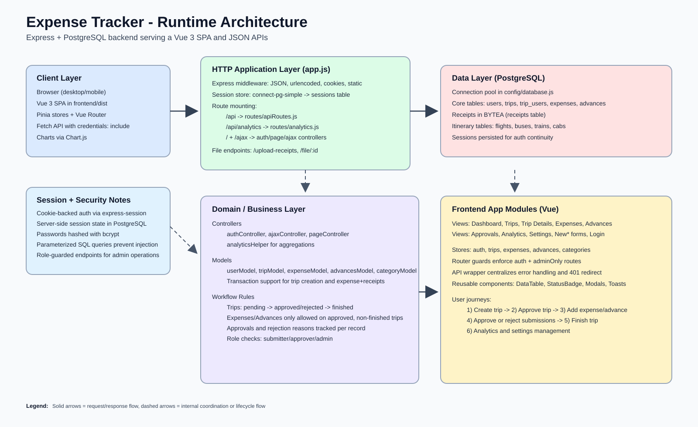

### Architecture Notes

1. Browser loads Vue SPA from backend-served static assets (`frontend/dist`) if built.
2. Frontend calls JSON APIs under `/api/*` with session cookies.
3. Express handles auth/session checks and delegates to controllers.
4. Controllers use model classes for domain behavior and validation.
5. Models execute parameterized SQL using a pooled PostgreSQL connection.
6. Session state is persisted in PostgreSQL (`sessions` table).

## 5. Full Working Flow

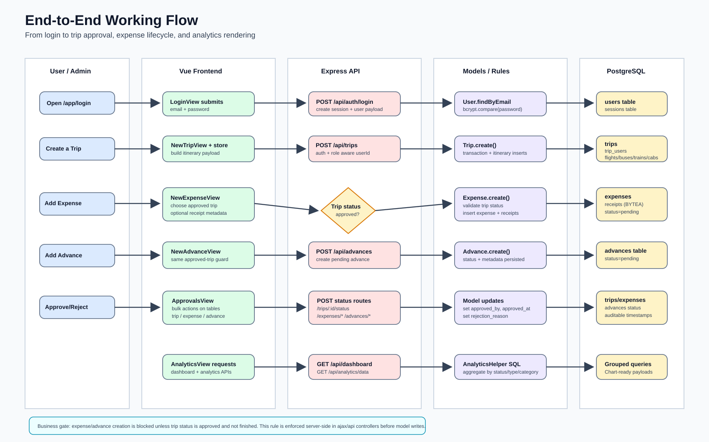

### Core Lifecycle

1. User logs in via `/api/auth/login`.
2. Session is created and persisted.
3. Submitter creates trips (status starts as `pending`).
4. Admin approves/rejects trips.
5. Expenses and advances can only be created for `approved` trips.
6. Admin reviews and approves/rejects expense and advance items.
7. Trip can be moved to `finished` after processing.
8. Analytics endpoints aggregate and return chart-ready data.

## 6. Database Design and ER Diagram

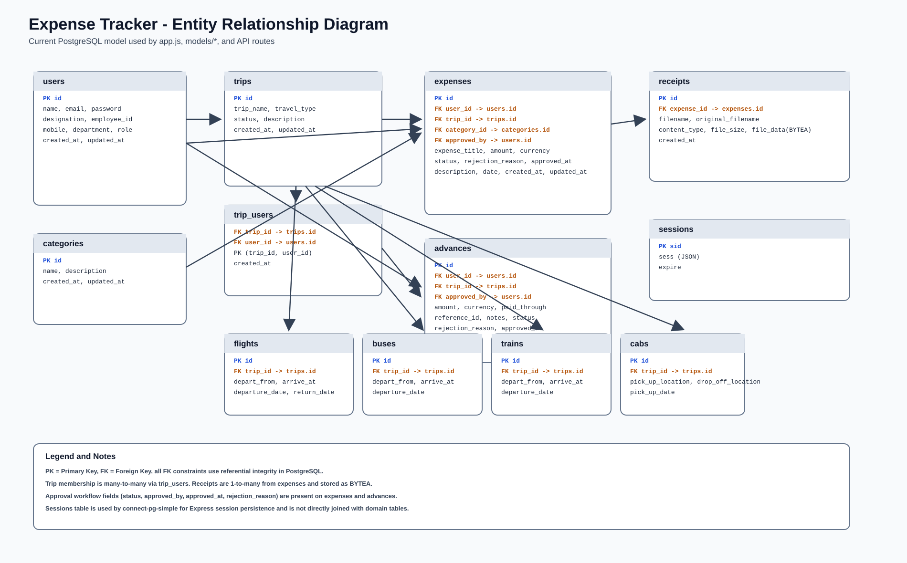

### Main Tables

- `users`: identity, department, designation, role
- `categories`: expense categories
- `trips`: trip request metadata and status
- `trip_users`: many-to-many mapping between trips and users
- `flights`, `buses`, `trains`, `cabs`: normalized itinerary segments
- `expenses`: expense transactions with approval fields
- `receipts`: binary receipt files linked to expenses
- `advances`: advance transactions with approval fields
- `sessions`: express-session persistence table

### Important Relationships

- `trip_users.trip_id -> trips.id`
- `trip_users.user_id -> users.id`
- `expenses.user_id -> users.id`
- `expenses.trip_id -> trips.id`
- `expenses.category_id -> categories.id`
- `receipts.expense_id -> expenses.id`
- `advances.user_id -> users.id`
- `advances.trip_id -> trips.id`

## 7. Backend Code Exploration

### 7.1 App Bootstrap (`app.js`)

Responsibilities:
- load env variables
- create Express app
- configure middleware and session storage
- mount API and web routes
- expose upload and file endpoints
- serve Vue build and fallback for SPA routes

Notable behavior:
- checks PostgreSQL connectivity at startup
- mounts `/api`, `/api/analytics`, `/`, `/ajax`
- uses `connect-pg-simple` with shared DB pool

### 7.2 Authentication and Session

Primary flow:
- Login request hits `POST /api/auth/login`
- User lookup through `User.findByEmail`
- Password check with `bcrypt.compare`
- Session object stores user profile and role
- Route guards validate `req.session.isAuthenticated`

Route guard behavior (`authMiddleware.js`):
- returns JSON `401` for API requests
- redirects browser requests to `/app/login`

### 7.3 API Layer (`routes/apiRoutes.js`)

Major endpoint groups:
- Auth: `/auth/login`, `/auth/logout`, `/auth/me`
- Users: CRUD with admin restrictions
- Trips: list, create, status update, finish
- Expenses: CRUD + approve/reject
- Advances: CRUD + approve/reject
- Categories, dashboard, analytics integration

### 7.4 Controllers

- `authController.js`: login/logout/index redirects for page routes
- `ajaxController.js`: legacy AJAX endpoints plus approval actions
- `pageController.js`: redirect-style page route compatibility
- `analyticsHelper.js`: SQL aggregations for charts and summaries

### 7.5 Model Layer

Each model wraps table operations and business-safe patterns:
- `userModel.js`
- `tripModel.js`
- `expenseModel.js`
- `advancesModel.js`
- `categoryModel.js`

Design choices:
- parameterized SQL for injection safety
- transaction helper for multi-table writes
- centralized connection/query helpers in `config/database.js`

### 7.6 Key Business Rules in Code

1. Trips default to `pending`.
2. Only admins can approve/reject/finish trips.
3. Expenses and advances are only allowed on approved trips.
4. Pending items can be approved or rejected with a reason.
5. Finished trips are terminal for new submissions.

## 8. Frontend Code Exploration

### 8.1 App Startup

- `frontend/src/main.js` boots Vue + Pinia + Router.
- `App.vue` performs initial `auth.checkAuth()`.

### 8.2 Router and Guards

`frontend/src/router/index.js` defines:
- guest route: `/app/login`
- authenticated shell: `/app/*`
- admin-only route: `/app/approvals`

Guard logic:
- load auth state before routing
- redirect unauthenticated users to login
- block admin-only routes for non-admin users

### 8.3 State Management (Pinia)

Stores:
- `auth.js`: login/logout/session user state
- `trips.js`: list/detail/status operations
- `expenses.js`: expense CRUD and approvals
- `advances.js`: advance CRUD and approvals
- `categories.js`: category management

### 8.4 API Client

`frontend/src/api/index.js`:
- central fetch wrapper
- `credentials: include` for session cookies
- uniform error handling
- auto-redirect on 401 (except auth checks)

### 8.5 Views and UX Modules

Primary views:
- Login, Dashboard
- Trips, New Trip, Trip Details
- Expenses, New Expense
- Advances, New Advance
- Approvals, Analytics, Settings

Shared components:
- layout shell (`AppLayout`)
- data table, status badges, modals
- toasts for feedback

## 9. Approval and Expense Workflow Details

### Trip Workflow

- Create trip -> `pending`
- Admin action -> `approved` or `rejected`
- Once reconciled -> `finished`

### Expense Workflow

- Expense creation validates trip state
- New expense status: `pending`
- Admin can approve in bulk or reject with reason

### Advance Workflow

- Same approval lifecycle as expenses
- supports payment metadata (`paid_through`, `reference_id`)

## 10. Analytics Implementation

Analytics uses SQL aggregations in `analyticsHelper.js`:
- expense totals by category
- trip counts by travel type
- advance totals by currency
- user-scoped and global (admin) views

Frontend renders results using Chart.js in `AnalyticsView.vue`.

## 11. Security and Data Integrity

Security controls:
- bcrypt password hashing
- session-based authentication
- role checks for privileged actions
- parameterized SQL statements

Integrity controls:
- foreign keys and constraints
- status checks in route/model logic
- transaction wrapping for multi-table writes

## 12. Setup and Run Instructions

### Prerequisites

- Node.js
- PostgreSQL running locally

### Install and run

```bash
npm install
cd frontend && npm install
```

### Database setup (recommended)

```bash
node database/setup-interactive.js
```

### Start app

```bash
npm start
```

Open:

- `http://localhost:5000/app/login`

### Optional sample users and data

```bash
node database/create-users.js
node database/seed-corporate-data.js
```

## 13. Visual Project Walkthrough (Screenshots)

### 13.1 Login

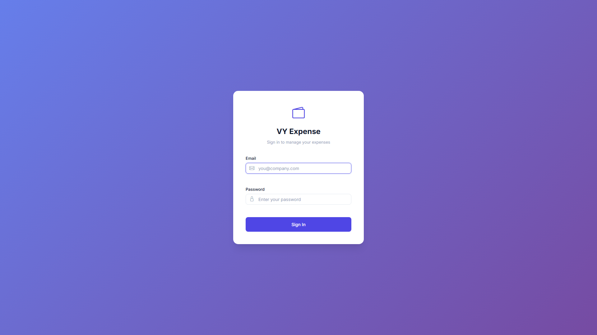

### 13.2 Dashboard

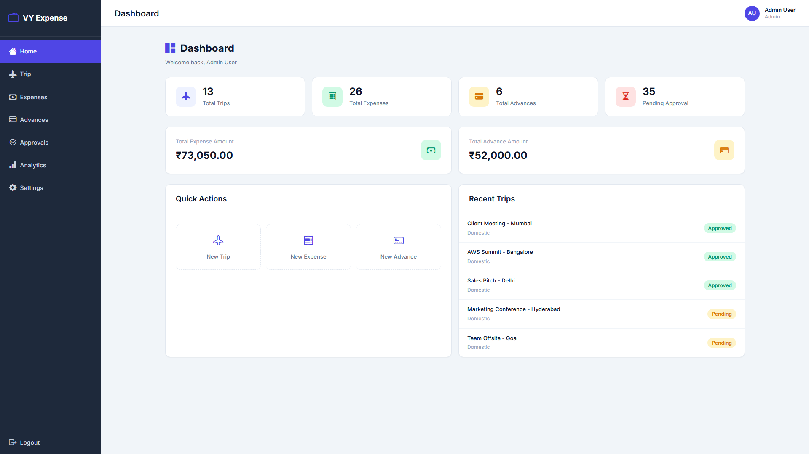

### 13.3 Trips List

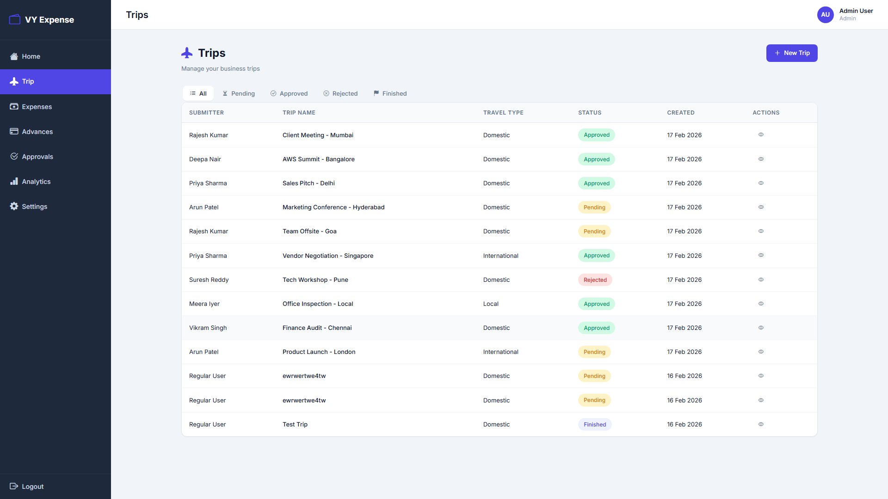

### 13.4 Trip Details

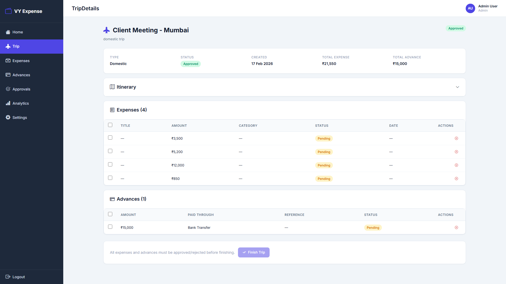

### 13.5 New Trip Form

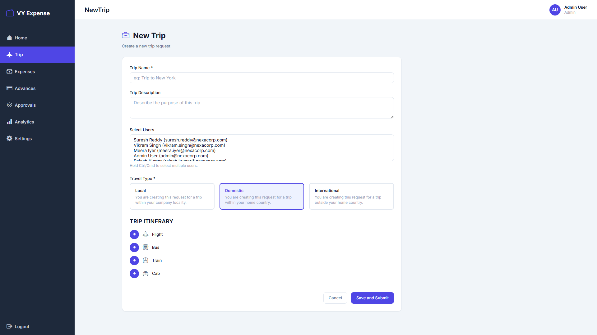

### 13.6 Expenses List

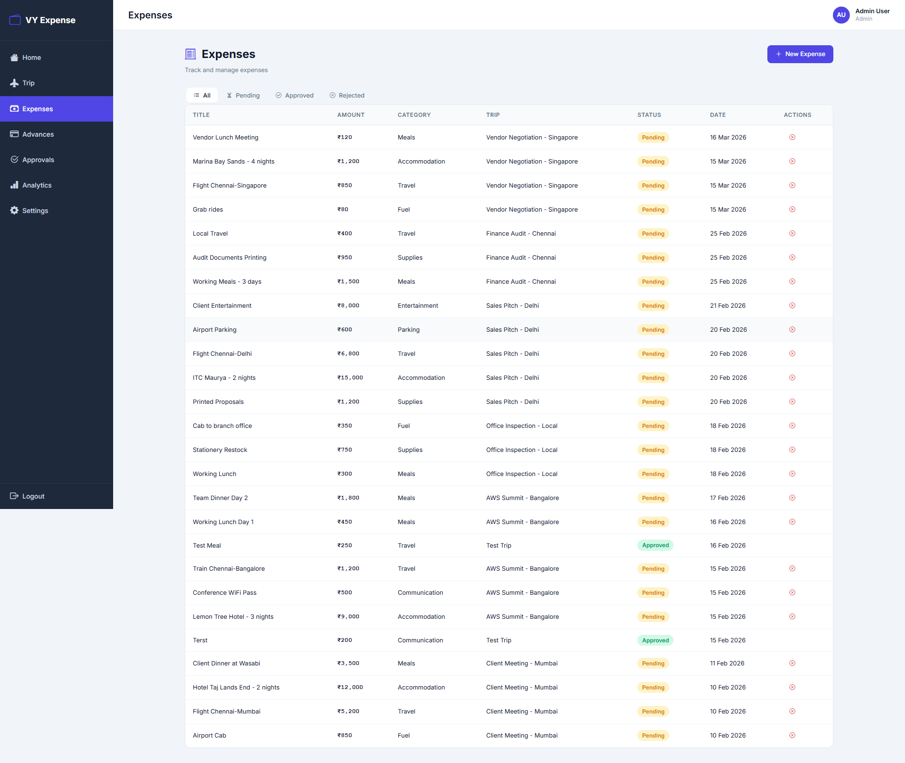

### 13.7 New Expense Form

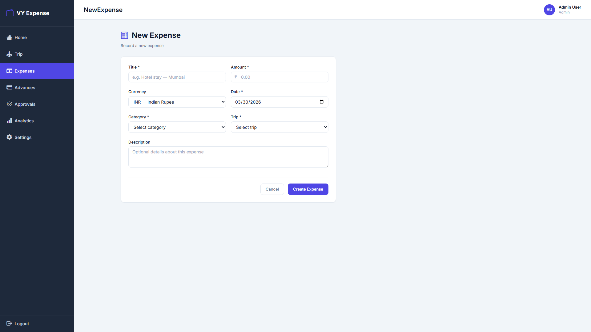

### 13.8 Advances List

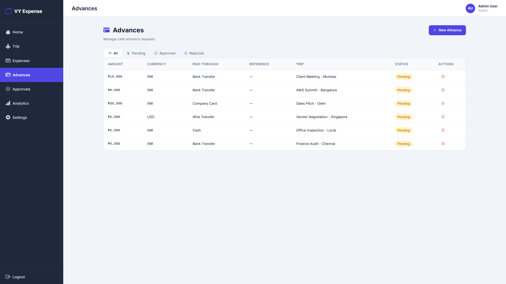

### 13.9 New Advance Form

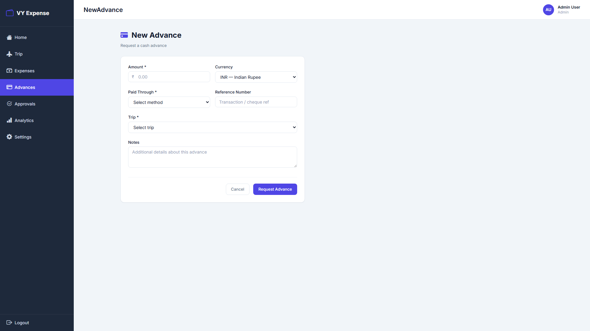

### 13.10 Approvals Module

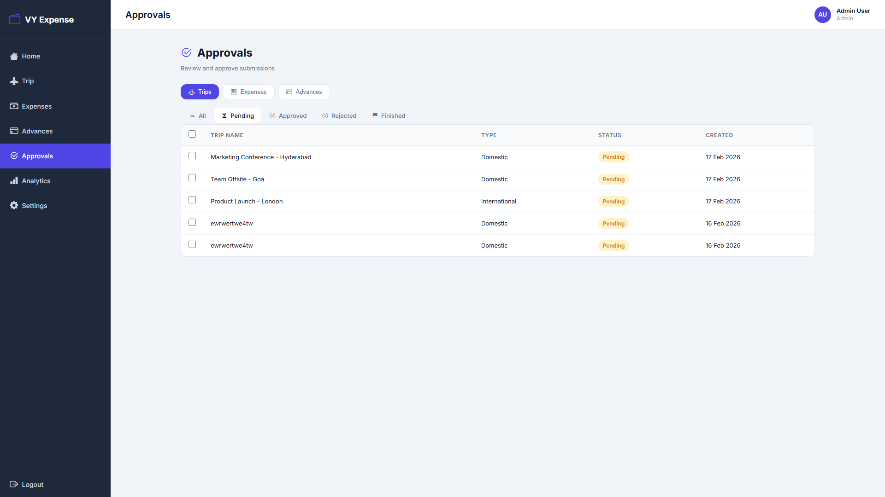

### 13.11 Analytics Module

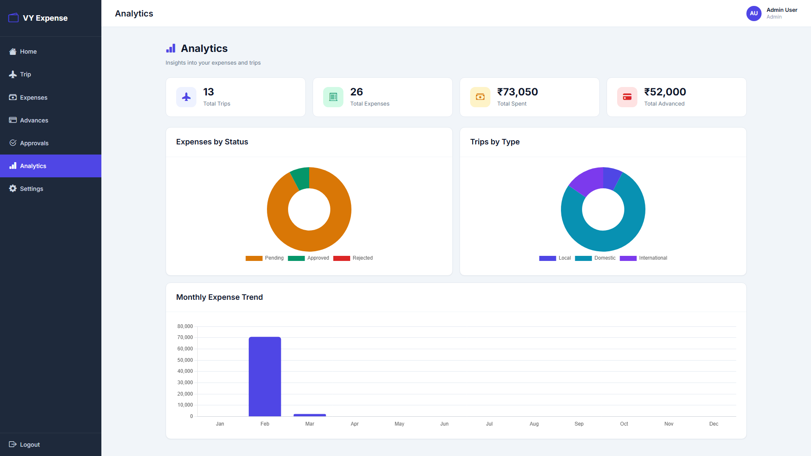

### 13.12 Settings and User Management

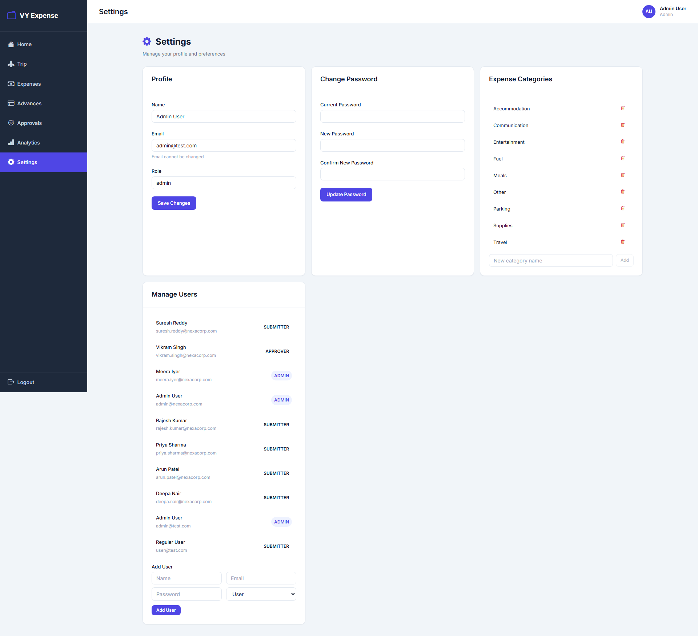

## 14. API Endpoint Summary

| Area | Method | Endpoint | Purpose |
|---|---|---|---|
| Auth | POST | `/api/auth/login` | Login and session creation |
| Auth | POST | `/api/auth/logout` | Destroy session |
| Auth | GET | `/api/auth/me` | Current session user |
| Trips | GET | `/api/trips` | List trips by role/filter |
| Trips | POST | `/api/trips` | Create trip with itinerary |
| Trips | POST | `/api/trips/:id/status` | Approve/Reject trip |
| Trips | POST | `/api/trips/:id/finish` | Mark trip finished |
| Expenses | GET | `/api/expenses` | List expenses |
| Expenses | POST | `/api/expenses` | Create expense |
| Expenses | POST | `/api/expenses/approve` | Bulk approve |
| Expenses | POST | `/api/expenses/:id/reject` | Reject with reason |
| Advances | GET | `/api/advances` | List advances |
| Advances | POST | `/api/advances` | Create advance |
| Advances | POST | `/api/advances/approve` | Bulk approve |
| Advances | POST | `/api/advances/:id/reject` | Reject with reason |
| Analytics | GET | `/api/analytics/data` | Chart/aggregation payload |

## 15. Testing and Quality

Current project test assets include:
- backend model/controller/route tests under `tests/`
- frontend tests under `frontend/tests/`

Recommended regression checks:
- login/logout session behavior
- role guard behavior (submitter vs admin)
- trip status transitions
- approved-trip-only creation for expenses/advances
- analytics data validity after approvals

## 16. Suggested Enhancements

1. Add JWT + refresh token option (if stateless scaling is needed).
2. Add audit history table for all status transitions.
3. Add object storage option for receipts (S3/Azure Blob) for large files.
4. Add E2E tests for major user journeys.
5. Add OpenAPI spec generation for API contracts.
6. Add structured logging + request IDs.

## 17. Conclusion

The application is a complete corporate expense-travel workflow platform with:
- robust relational data model
- clear approval lifecycle
- full frontend experience for submitters and admins
- practical analytics for operational insight

This documentation package includes architecture and ER vector diagrams, live walkthrough screenshots, and complete technical exploration of how the codebase works end to end.
